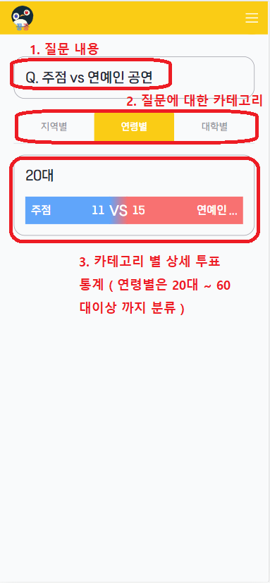

 # GGONG

> [0. 프로젝트 개요](#0-프로젝트-개요)
> 
> [1. 서비스 및 기능 소개](#1-서비스-및-기능-소개)
> 
> [2. 서비스 화면](#2-서비스-화면)
>   - [로그인 / 가입](#로그인--가입)
>   - [메인화면](#메인화면)
>   - [메뉴바](#메뉴바)
>   - [마이페이지](#마이페이지)
>   - [지도](#지도)
>   - [투표 화면](#투표-화면)
>   - [포인트 관련 화면](#포인트-관련-화면)
>   - [통계](#통계)
>   - [기기화면](#기기화면)
>   
> [3. 시스템 아키텍처](#3-시스템-아키텍처)
> 
> [4. 컴포넌트 구성도](#4-컴포넌트-구성도)
> 
> [5. ERD](#5-erd)
> 
> [6. 서비스 및 기술 특장점](#6-서비스-및-기술-특장점)
> 
> [7. 멤버 및 역할](#7-멤버-및-역할)

## 0. 프로젝트 개요

✔ 프로젝트명 : GGONG(꽁수래 꽁수거)

✔ 한줄 소개 : Web IoT를 기반으로 한 투표식 담배꽁초 수거함

✔ 개발 기간 : 23.07.10 ~ 23.08.18 (6주)

✔ 팀원 : 정예지 김동현 민병기 전주영 정의석 홍성민

✔ 사용 기술스택 : SpringBoot, React, Docker, AWS + (4. 시스템 아키텍처 참고)

## 1. 서비스 및 기능 소개

### 웹
#### 로그인 / 가입

#### 메인화면

#### 메뉴바

#### 마이페이지

#### 지도

#### 투표 화면

#### 포인트 관련 화면

#### 통계

### IoT
#### 멤버화면

#### 카메라

#### 메인화면

## 2. 시스템 아키텍처

## 3. 컴포넌트 구성도

## 4. ERD

## 5. 서비스 및 기술 특장점

1. 실시간 투표 정보 출력
2. 담배꽁초 수거함의 질문을 주기적으로 바꿔주어 사용자들의 흥미 유발
3. 담배꽁초 수거함이 위치한 곳에 따라 질문 주제를 다르게 제시해 사용자들의 흥미 유발
4. 투표 데이터 세분화
5. 시간대별로 기기별 혼잡도를 출력(그래프 활용)
6. 회원 데이터별 통계
7. 기기 설치 장소에 따라 특화 질문 출력

## 6. 멤버 및 역할

<table>
  <tr>
    <td align="center"><a href="https://github.com/ityeji"> <b>정예지</b></a> </td>
    <td align="center"><a href="https://github.com/hannernos"> <b>김동현</b></a> </td>     
    <td align="center"><a href="https://github.com/bmincof"> <b>민병기</b></a> </td>
    <td align="center"><a href="https://github.com/juuyoungjeon"> <b>전주영</b></a> </td>      
    <td align="center"><a href="https://github.com/ian813"> <b>정의석</b></a> </td>     
      <td align="center"><a href="https://github.com/HHongmoris"> <b>홍성민</b></a> </td>   
  </tr>
</table>

✔ **정예지** 
- 팀장
- PM
- Jira 관리
- Backend Entity 및 API 구현
- Backend Spring Data JPA 적용
- Backend 에러 및 API 디버깅
- Backend SSE 구현
- ERD 설계 및 Backend RDBMS(MySQL) 적용
- DB 더미데이터 생성

✔ **김동현** 
- EC2 DB설치 및 환경 설정
- IoT 프로세스 로직 설계
- IoT H/W 디자인
- IoT 디렉토리 구조 설계
- IoT QT 화면 디자인
- IoT  QT 시그널 설계
- IoT  QT 쓰레드 설계
- IoT  MQTT5 구현
- IoT MQTT5 토픽 설계
- IoT AWS IoT 연결
- IoT AWS SQS 연결
- IoT AWS Lambda 연결
- IoT 카메라를 통한 QR 인식 구현
- IoT  초음파센서를 통한 투표 구현
- IoT  데이터베이스 연결
- IoT  데이터 Object 설계
- IoT  질문 알고리즘 구현
- IoT 타이머 구현
     

✔ **민병기**
- Frontend 컴포넌트 설계
- Frontend 버튼, 모달, 리스트 컴포넌트 구현
- Frontend 차트 구현을 통한 데이터 시각화
- Frontend api 통신 구현
- 카카오 api 활용 소셜 로그인, 지도 페이지 구현
- Backend, Frontend SSE 통신 구현
- 빌드 및 배포
     

✔ **전주영**
- Spring Boot를 활용한 REST API 구축
- JWT와 Spring Security를 활용한 로그인 구현
- OAuth2 카카오 로그인 api 구현
- 자체 로그인 회원인 경우 비밀번호 암호화 알고리즘 구현
- Spring Boot JPA를 활용한 DB 구축
- Backend Entity 및 API 구현
- Docker 및 Jenkins를 활용한 CI/CD 구축
- Docker container에 DB 구축
- Docker 및 AWS를 활용한 서버 배포
- Nginx를 활용한 프론트 웹서버 구축, 백엔드 서버 구축 및 리버스 프록시 설정 및 적용
     

✔ **정의석** 
- Figma를 활용한 Prototype 제작
- Frontend 카드, 드롭다운, 메뉴바 컴포넌트 구현
- Frontend 메인페이지 구현
- Frontend 투표페이지 구현
- Frontend 통계페이지 구현
- Frontend Chart.js를 이용한 꺾은선 그래프 구현
- Frontend Redux 적용
- DB 더미데이터 생성
     

✔ **홍성민**
- Backend Entity 및 API 구현
- Backend Spring Data JPA 적용
- Backend 에러 및 API 디버깅
- ERD 설계 및 Backend RDBMS(MySQL) 적용
- Figma를 활용한 와이어프레임 및 목업 디자인
- 서비스 로고 제작
- IoT 기기 제작
- UCC 대본 작성 및 촬영 편집
- 프로젝트 발표

## 7. 멤버별 회고
✔ **정예지**
- 처음으로 진행한 프로젝트에서 팀장 직책을 맡아 전반적으로 프로젝트가 어떻게 진행되는지 공부할 수 있는 좋은 기회였습니다.
- 기획을 꼼꼼하게 하고 진행한 프로젝트였음에도 불구하고, 개발을 하면서 빈틈이 많다는 것을 많이 느꼈습니다. 기획을 꼼꼼하게 하고 그것을 문서화하는 것에 대한 중요성을 크게 체감했습니다.
- 다음 프로젝트 때는 디버깅 과정 또한 문서화 해야겠다고 생각했습니다.

✔ **김동현**
- 아쉬움이 많은 프로젝트였습니다.
기획 단계에서 고려하지 못한 부분들을 꼼꼼하게 살피고 각 작업들의 소요시간을 더욱 정확하게 파악했다면 시간을 아끼고 다른 부분에 집중해서 결과물의 완성도가 더 높아졌을 것이기에, 다음 프로젝트에서는 더 철저히 준비하고 기획해야겠다는 아쉬움이 남습니다.
- IoT 변경사항
  - 데이터를 가공하고 삽입하는 기능이 프로젝트 중간에 IoT에 추가되어
코드의 전체 구조를 변경하였습니다.

- 초음파 센서의 한계
  - 초음파센서 1개만으로 20cm, 40cm 전방 일직선에 들어오는 물체를
카운팅을 하고자 하였지만,
부채꼴 형태의 센서 범위로 인해 정확하게 위치시키기 어려웠습니다.

  - 이를 고려해서 데이터를 고려하고 디렉토리 구조를 설계하였다면 많은 시간을 아끼고 다른 부분의 완성도를 더 높일 수 있었으며 초음파 센서를 한개 더 구매했다면 카운팅 정확도를 더 올릴 수 있었을 텐데 하는 아쉬움이 남습니다.

✔ **민병기**
- 문서화의 중요성을 느꼈다. 계획 수립과 전달 사항은 문서화를 잘 해서 팀원들이 그 날의 목표를 잘 이해하고 실행할 수 있었다. 그러나 버그와 그 해결 방법은 제대로 문서화가 이루어지지 않아서, 같은 버그가 나중에 일어났을 때 똑같이 많은 시간을 투자해야 했다.
- 또 빌드 및 배포 과정에 대한 매뉴얼 등이 있었다면 더 원활한 협업이 가능했을 것 같다.

✔ **전주영**
- 처음으로 OAuth2를 사용한 로그인 개발이어서 초반에는 많이 헤맸지만 보안을 고려하며 완성시키고 보니 많은 경험을 쌓을 수 있어서 좋았다.
- 초기에 파이프라인을 구축하지 않고 수동배포를 해보니 자동배포의 중요성을 알 수 있었다.

✔ **정의석**
- 첫 팀프로젝트였던 만큼 나에게 많은 의미가 있었다.
Jira를 통한 이슈 관리와 기능명세서를 상세히 작성하는 법, 그리고 컨벤션 통일 등
처음 경험하는 것들 투성이라 힘들었지만 덕분에 많이 배울 수 있었다.
- 그리고 팀프로젝트에 있어 가장 중요한 것은 역시 소통이라는 것을 직접 체험하였고,
React.js를 처음 사용해보며 기술적 성장을 이룰 수 있어 뿌듯했다.
앞으로의 프로젝트에서도 하나씩 배우며 성장하고 싶다.

✔ **홍성민**
- 체계적인 기획과 꼼꼼한 설계 단계가 개발에 있어서 매우 중요하다는 것을 깨달았고, 팀원들과의 소통과 빠른 피드백의 중요성을 배울 수 있었다.
- 이번 프로젝트를 통해 jpa를 활용한 백엔드 구현을 배우고 적용할 수 있었다. 다양한 에러들을 접하고 디버깅하며 구조를 몸소 익힐 수 있었고 데이터의 흐름을 더 잘 파악할 수 있었다.
- 완성도 측면에서 아쉬움이 많이 남는다. 다음 프로젝트는 더 구체적인 계획과 소통을 통해 완성도를 끌어올리고 싶다.
